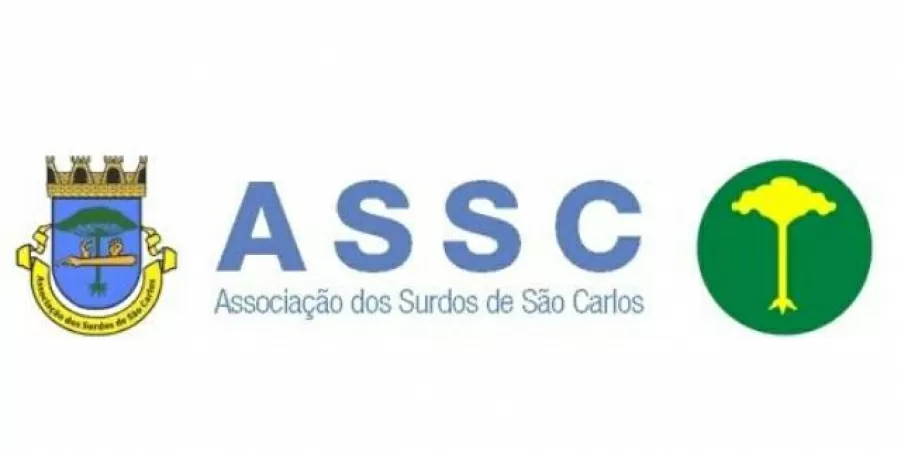

# Projeto de Desenvolvimento do Site para a ASSC

> Nosso projeto envolve a criação de um site para a Associação de Surdos de São Carlos, destinado a promover a inclusão e a comunicação acessível. A plataforma fornecerá informações, recursos e suporte para a comunidade surda, facilitando a integração social e o acesso a serviços essenciais. Além disso, incluirá conteúdos educativos e eventos para fortalecer a interação entre membros e a sociedade.

### Sprints

O projeto ainda está em desenvolvimento e as próximas atualizações serão voltadas nos seguintes sprints:

- [x] Sprint 1
- [x] Sprint 2
- [x] Sprint 3
- [x] Sprint 4
- [x] Sprint 5
- [x] Sprint 6

## 💻 Depedencias de software e ferramentas utilizadas

Para a confecção do projeto foram utilizadas as seguintes ferramentas, incluindo linguagens e frameworks:

- Linguagens: `HTML, CSS, Javascript, SQL`
- Frameworks: `Bootstrap e React`.
- Mais ferramenta: `Github, discord, Trello`.

## 📚 Disciplinas

O projeto reprensenta o profundo entendimento e aprendizado das materias de Engenharia de Software e Desenvolvimento Web, tendo sido desenvolvido com auxílio das professoras:

Engenharia de Software:
- Docente: Rosana Teresinha Vaccare Braga
- Docente: Simone do Rocio Senger de Souza

Desenvolvimento Web:
- Docente: Bruna Carolina Rodrigues da Cunha

## 🤝 Membros da equipe

Nossos membros:

<table>
  <tr>
    <td align="center">
         
        
          <b>Luiz shulz</b>
        
      </a>
    </td>
    <td align="center">
         
        
          <b>João Brasileiro</b>
        
      </a>
    </td>
    <td align="center">
         
        
          <b>Vicenzo D´Arezzo</b>
        
      </a>
    </td>
    <td align="center">
         
        
          <b>Nicholas Yudi</b>
        
      </a>
    </td>
    <td align="center">
         
        
          <b>Lucas de Souza</b>
        
      </a>
    </td>
    <td align="center">
         
        
          <b>João Calixto</b>
        
      </a>
    </td>
  </tr>
</table>
